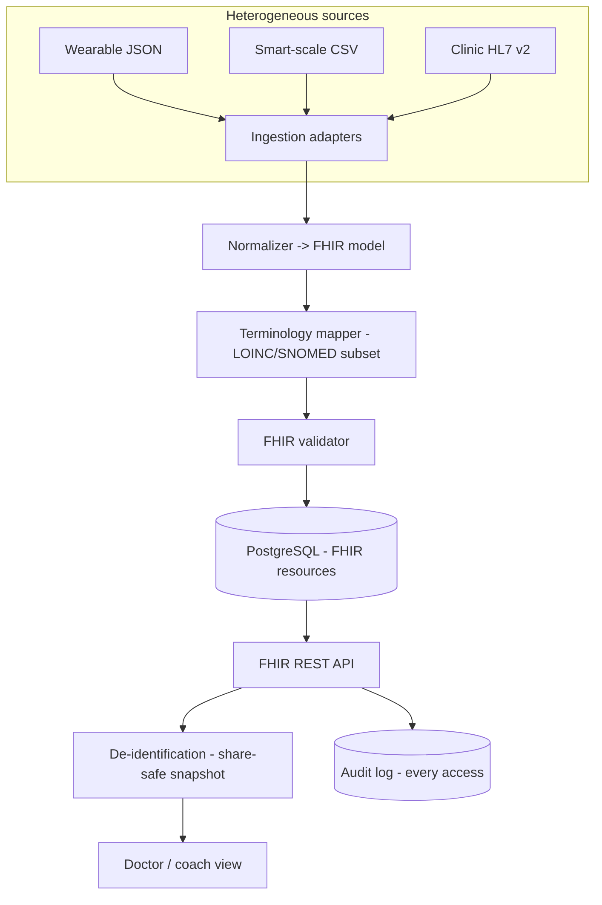

# P5 — VitalsHub: a personal health-data passport

> Leans on your GDPR-deletion + audit-trail + compliant-API experience — a rare, credible healthcare angle.

## 1. What it is

VitalsHub is a personal "health passport" that pulls your data out of many **mismatched sources** — a fake Fitbit-style JSON export, an Apple-Health-style dump, a smart-scale CSV, and a clinic's HL7 v2 message — and unifies them into one clean timeline you actually own. Then it lets you **safely share a de-identified snapshot** with a coach or doctor and logs **exactly who saw what**.

It is not an EHR clone. It's an **interoperability + privacy** engine. Unifying incompatible health formats is precisely the **HL7/FHIR** problem healthcare software lives on, and "share safely + log every access" is the **PHI de-identification + HIPAA audit** problem. You normalize heterogeneous inputs into a common model (echoing your Market Data Engine normalize stage) and apply the compliance rigor you already practiced with GDPR deletions and audited APIs.

## 2. What you'll demonstrate

- **Standards-based interoperability** — parse HL7 v2, produce/consume **FHIR** resources.
- **Normalization** of messy heterogeneous inputs into one validated model.
- **Terminology mapping** — local codes to a LOINC/SNOMED subset.
- **PHI de-identification** — Safe-Harbor-style redaction for a shareable snapshot.
- **Consent + audit** — every read/write logged (who/what/when/why), 100% coverage.
- **Validation & data quality** — resources validated against profiles.

## 3. Tech stack (and why)

- **Java 21 + Spring Boot + HAPI FHIR** — HAPI is the de-facto open-source FHIR library (models, validation, a FHIR REST server). Reuses your Spring stack. (Python alternative: `fhir.resources` + FastAPI.)
- **PostgreSQL** — store normalized resources (JSONB) + audit log; you can use HAPI's JPA server or your own schema.
- **Synthea** — generates realistic **synthetic** patient data so you never touch real PHI.
- **Docker Compose**, **JUnit + Testcontainers**.
- Optional **React** timeline viewer.

## 4. Architecture



## 5. Data model

- Internal model = **FHIR resources**: `Patient`, `Observation` (heart rate, weight, steps, labs), `Encounter`.
- Each source gets an **adapter** that maps its fields to FHIR (e.g., scale CSV `weight_kg` -> `Observation` with LOINC `29463-7`).
- **Audit event** (align with FHIR `AuditEvent`): `{ who, action(read/write), resourceType, resourceId, ts, purpose, outcome }`.
- **Consent** record: which recipient may see which categories, and whether it's de-identified.

## 6. Implementation plan (milestones)

**M1 — FHIR foundation.** Stand up a HAPI FHIR server (or your own resource store). Load Synthea-generated patients. Confirm you can `GET`/`POST` `Patient` and `Observation` and that validation runs.

**M2 — Ingestion adapters + normalization.** Build 3–4 adapters (wearable JSON, scale CSV, HL7 v2 message, Apple-Health-style XML). Each parses its quirky format and emits normalized FHIR `Observation`/`Encounter` resources. This is the heart: many messy inputs -> one clean model.

**M3 — Terminology mapping + validation.** Map source codes to a curated LOINC/SNOMED subset. Validate every produced resource against FHIR profiles; quarantine and report anything that fails (data-quality metric).

**M4 — Unified timeline API.** FHIR search endpoints to pull a patient's unified timeline across all sources (e.g., all weight observations sorted by date). This proves the interoperability payoff.

**M5 — De-identification + consent.** Implement Safe-Harbor-style redaction (strip names, exact dates -> year, geographic precision, identifiers) to produce a share-safe snapshot. Gate sharing behind a consent record (recipient + allowed categories).

**M6 — Audit everywhere.** Wrap every read/write with an audit interceptor writing an `AuditEvent`. Add an audit query API ("who accessed my data?"). Prove 100% coverage with a test that asserts no data-access path bypasses the interceptor.

## 7. The hard parts, explained

- **Format quirks:** HL7 v2 is pipe-delimited segments (`OBX`, `PID`) — very different from FHIR's JSON. Wearable exports nest deeply. The adapter layer must isolate this messiness so the core only sees clean FHIR (same principle as your Market Data Engine "normalize" stage).
- **Code mapping is lossy:** not every source code has a clean LOINC equivalent; decide and document how you handle unmapped codes (flag, don't silently drop).
- **De-identification is subtle:** Safe Harbor lists 18 identifier categories; dates need generalization (keep year, drop day) and ages > 89 are aggregated. Getting this "mostly right" and documenting the limits is the credible move.
- **Audit completeness:** the interceptor must be un-bypassable — enforce it at a layer every access must pass through, and test that.

## 8. Testing & correctness

- **Adapter round-trip tests:** known source file -> expected FHIR resource (golden files).
- **Validation tests:** valid resources pass, malformed ones are quarantined with a clear reason.
- **De-id tests:** assert no PHI category leaks into the shared snapshot; assert dates are generalized.
- **Audit tests:** every endpoint produces an audit event; a test proves there is no access path without one.
- **Consent tests:** a recipient without consent for a category cannot retrieve it.

## 9. Benchmarking & metrics

- **Records normalized/sec** across the adapters.
- **Validation pass rate** against FHIR profiles (and quarantine rate).
- **De-identification coverage** = PHI fields redacted / PHI fields present (target 100% of the categories you handle).
- **Audit completeness** = 100% of data-access operations logged.

## 10. How to run

```bash
docker compose up -d              # postgres (+ HAPI if separate)
./gradlew bootRun
python data/synthea_load.py       # load synthetic patients
curl localhost:8080/fhir/Observation?patient=...&code=29463-7   # unified weight timeline
```

## 11. Suggested repo structure

```
vitalshub/
  adapters/          # wearable-json, scale-csv, hl7v2, apple-health -> FHIR
  normalize/         # common-model mapping + terminology mapper
  fhir/              # HAPI server config / resource store, validation
  deid/              # Safe-Harbor redaction
  consent/           # consent records + enforcement
  audit/             # AuditEvent interceptor + query API
  viewer/            # optional React timeline
  data/              # synthea loader (synthetic only)
  docker-compose.yml
  README.md          # standards used, de-id approach + limits, audit design
```

## 12. Stretch goals

- **SMART-on-FHIR OAuth2** authorization for recipients.
- **Bulk FHIR export** ($export) of the de-identified dataset for "research."
- **Anomaly flags** on the timeline (e.g., a resting-HR trend alert).

## Resume bullets (tune with your real numbers)

- Built **VitalsHub**, a health-data interoperability engine (**Java**, **Spring Boot**, **HAPI FHIR**, **PostgreSQL**) that ingests HL7 v2 and heterogeneous wearable exports and normalizes them to a validated **FHIR** model with LOINC/SNOMED terminology mapping.
- Added a Safe-Harbor **PHI de-identification** pipeline and un-bypassable **audit logging** on every data-access operation, achieving **100%** audit coverage for HIPAA-style traceability.
