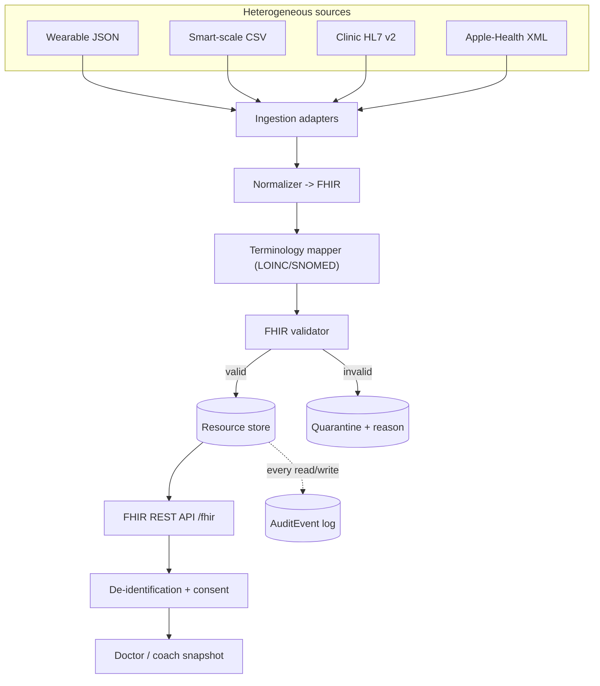

# VitalsHub — a personal health-data passport

[](https://github.com/rakman09/vitalshub/actions/workflows/ci.yml)
[](https://rakman09.github.io/vitalshub/)

**▶ Live interactive demo: https://rakman09.github.io/vitalshub/** — ingest the messy
sources, watch them unify into a FHIR timeline, share a de-identified snapshot under
consent, and inspect the audit trail. It runs the *same pipeline logic* as the backend,
live in your browser.

VitalsHub is an **interoperability + privacy engine** for personal health data. It
pulls your data out of many mismatched sources — a Fitbit-style wearable JSON
export, an Apple-Health-style dump, a smart-scale CSV, and a clinic's HL7 v2
message — and unifies them into one clean, validated **FHIR** timeline you own.
It then lets you **safely share a de-identified snapshot** with a coach or doctor
and logs **exactly who saw what**.

It is not an EHR clone. It normalizes heterogeneous inputs into a common model
(the HL7/FHIR interoperability problem) and applies HIPAA-style privacy rigor
(PHI de-identification + an un-bypassable audit trail).

This project implements [P5-VitalsHub.md](P5-VitalsHub.md).

## Standards used

| Concern | Standard |
| --- | --- |
| Common clinical model | **FHIR R4** (`Patient`, `Observation`, `Encounter`, `AuditEvent`, `Consent` concepts) via HAPI FHIR |
| Clinic messaging | **HL7 v2** (ORU^R01, parsed with HAPI HL7v2) |
| Terminology | **LOINC / SNOMED CT** subset (config-driven mapping) |
| Units | **UCUM** on quantities |
| De-identification | **HIPAA Safe Harbor** method |
| Audit | FHIR **AuditEvent** on every read/write |

## Architecture



Every path to the database goes through a single `FhirResourceStore`, which
records an `AuditEvent` on each operation — see [Audit design](#audit-design).

## Tech stack

- **Java 21**, **Spring Boot 3.4**, **HAPI FHIR 8.x** (R4 model, validation, embedded `RestfulServer`)
- **HAPI HL7v2** for parsing HL7 v2 messages
- **Spring Data JPA** with **H2** (dev/test) or **PostgreSQL** (prod)
- **Gradle** (wrapper included), **JUnit 5** + AssertJ

## How to run

### Quick start (H2, no Docker required)

```bash
./gradlew bootRun            # starts on http://localhost:8080 with in-memory H2
python data/synthea_load.py  # loads synthetic data and exercises the whole pipeline
```

`synthea_load.py` creates a synthetic patient, ingests all four sample sources,
prints the unified weight timeline, grants consent, fetches a de-identified
share, and prints the audit trail. (It is a lightweight stand-in for a full
Synthea run — see the script header for how to swap in real Synthea bundles. No
real PHI is ever used.)

### Production (PostgreSQL via Docker)

```bash
docker compose up -d --build   # PostgreSQL + the app (prod profile)
python data/synthea_load.py
```

The `prod` profile reads `DB_URL`, `DB_USER`, `DB_PASSWORD` (defaults target the
compose Postgres).

### Example requests

```bash
# Unified weight timeline across all sources (the interoperability payoff)
curl "localhost:8080/fhir/Observation?patient=Patient/<id>&code=29463-7&_sort=date"

# Ingest a raw source payload
curl -X POST "localhost:8080/api/ingest/scale-csv?patientId=<id>" \
     -H "X-Actor: importer" --data-binary @data/samples/scale.csv

# Grant consent, then share a de-identified snapshot
curl -X POST localhost:8080/api/consent -H "Content-Type: application/json" \
     -d '{"patientId":"<id>","recipient":"coach","categories":["body-composition"],"requireDeidentified":true}'
curl "localhost:8080/api/patients/<id>/share?recipient=coach"

# Who accessed my data?
curl "localhost:8080/api/patients/<id>/access-log"

# Data-quality metrics
curl "localhost:8080/api/metrics/data-quality"
```

### Interactive API explorer (Swagger UI)

With the app running, browse the `/api` endpoints interactively at
**http://localhost:8080/swagger-ui.html** (OpenAPI spec at `/v3/api-docs`). The FHIR
endpoints under `/fhir` expose a FHIR CapabilityStatement at `/fhir/metadata`.

## Live demo (GitHub Pages)

The [`docs/`](docs/) folder is a self-contained, static, interactive demo of the
whole pipeline — no server or database required. It runs a faithful browser port of
the backend logic (adapters → normalize → terminology map → validate → store, plus
de-identification, consent, and audit) against the same sample data and terminology
map. That port is verified in CI by a Node self-test ([`tools/pages-selftest.cjs`](tools/pages-selftest.cjs))
that asserts it reproduces the backend's behaviour.

To publish it (one-time): **Settings → Pages → Build and deployment → Source:
GitHub Actions**. The [`pages.yml`](.github/workflows/pages.yml) workflow then deploys
`docs/` on every push to `main` (or via *Run workflow*). The site appears at
`https://<owner>.github.io/vitalshub/`.

## Verifying it works (for reviewers)

- **CI badge** — `./gradlew test` runs on every push (17 tests) plus the demo self-test; a green badge is objective proof it builds and passes.
- **Live demo** — click the Pages link above and drive the whole flow in the browser.
- **Run locally** — `./gradlew bootRun` then `python data/synthea_load.py` reproduces the end-to-end flow against the real API.
- **Swagger UI** — click through the real endpoints at `/swagger-ui.html`.

## API reference

| Method & path | Purpose |
| --- | --- |
| `GET/POST /fhir/Patient`, `/fhir/Observation`, `/fhir/Encounter` | FHIR CRUD + search (validated) |
| `GET /fhir/Observation?patient=&code=&_sort=date` | Unified, date-sorted timeline |
| `GET /fhir/AuditEvent` | Raw FHIR audit records (read-only) |
| `POST /api/ingest/{sourceType}?patientId=` | Ingest a raw source payload |
| `GET /api/ingest/sources` | List supported source types |
| `POST /api/consent`, `GET /api/consent` | Manage consent records |
| `GET /api/patients/{id}/share?recipient=` | Consent-gated (de-identified) snapshot |
| `GET /api/patients/{id}/access-log` | "Who accessed my data?" |
| `GET /api/metrics/data-quality`, `GET /api/quarantine` | Data-quality metrics & quarantine queue |

## De-identification approach and limits

`DeidentificationService` applies the **HIPAA Safe Harbor** method to the
identifier categories reachable in this data model:

- **Names, telecom (phone/email), addresses/geography, identifiers (MRN etc.)** are removed.
- **All dates are generalized to year only** (e.g. birth date, observation effective date).
- **Ages over 89 are aggregated** to a "90+" flag rather than an exact age.
- Output resources are **relinked to a fresh pseudonym** and tagged with an `ANONYED` security label.

**Documented limits (honest about scope):** this handles the structured identifier
categories on `Patient`/`Observation`/`Encounter`. It does **not** scan free-text
narrative for embedded identifiers, and it assumes coded clinical values do not
themselves carry PHI. As defense-in-depth, `assertNoResidualPhi` fails loudly if
an obvious identifier survives, and sharing is always gated by a consent record.

## Consent

A `ConsentRecord` binds a `(patient, recipient)` pair to a set of allowed
**categories** (e.g. `body-composition`, `vitals`, `activity`, `labs`) and a
`requireDeidentified` flag. `ShareService` refuses to share without a matching
consent (HTTP 403), discloses only the allowed categories, and de-identifies when
required.

## Audit design (un-bypassable)

The audit interceptor is **un-bypassable by construction**:

- `StoredResourceRepository` (the only door to the database) is **package-private**,
  so it can be injected only by `FhirResourceStore`.
- `FhirResourceStore` is therefore the single chokepoint for every read and write,
  and it records a FHIR `AuditEvent` (`who / action / resourceType / resourceId /
  when / purpose / outcome`) for each operation.
- Each audit record is linked to the data subject (patient) so the trail is
  queryable per patient.

`AuditCoverageTest` proves both properties: five data-access operations produce
exactly five audit events (100% coverage), and the repository is asserted to be
non-public.

## Terminology mapping

`TerminologyMapper` is config-driven ([mappings.csv](src/main/resources/terminology/mappings.csv)):
it maps each source code to a LOINC/SNOMED subset while **preserving the original
source code as provenance**. Mapping is lossy — codes with no known equivalent are
**flagged** (a `meta.tag` plus a report entry), never silently dropped.

## Data-quality metrics (spec section 9)

`GET /api/metrics/data-quality` reports validation pass rate, quarantine rate,
terminology mappings loaded, unmapped codes, and records normalized per second.

## Testing

```bash
./gradlew test
```

Covers: FHIR foundation smoke tests, adapter round-trips (golden inputs),
end-to-end ingestion with terminology mapping, validation quarantine,
cross-source unified timeline, de-identification, consent enforcement, and audit
coverage/un-bypassability.

## Repository structure

```
src/main/java/com/vitalshub/
  adapters/    # wearable-json, scale-csv, hl7v2, apple-health -> FHIR + IngestionService
  normalize/   # ObservationFactory + terminology mapper
  fhir/        # HAPI RestfulServer config, resource store (audit chokepoint), providers, validation, timeline
  deid/        # Safe-Harbor de-identification + share service
  consent/     # consent records + category resolver + enforcement
  audit/       # AuditEvent factory, context, query service
  quarantine/  # invalid-resource store
  metrics/     # data-quality metrics
  web/         # REST controllers (ingest, consent, share, audit, metrics)
data/          # synthetic loader + sample source files
docker-compose.yml, Dockerfile
```

## Environment notes

- This repository is developed and tested against **embedded H2** so it runs with
  no external services. The **PostgreSQL** profile and `docker-compose.yml` are
  provided for production; switch with `SPRING_PROFILES_ACTIVE=prod`.
- **Synthea** and **Testcontainers** are optional (both need extra tooling/Docker);
  the bundled synthetic samples + H2 give an equivalent, self-contained pipeline.
